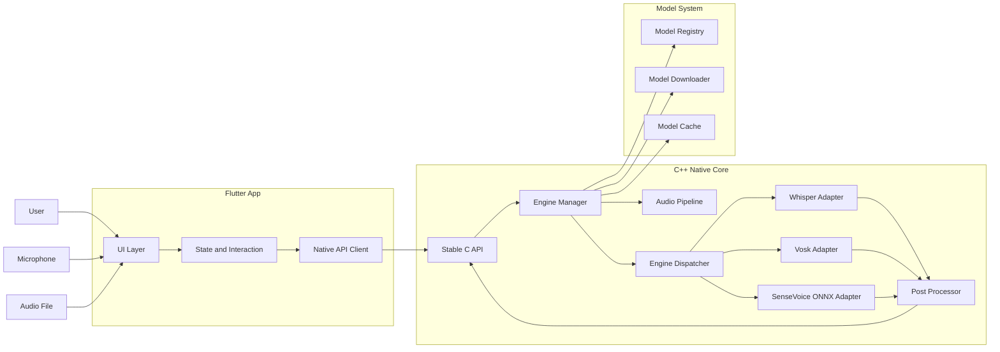
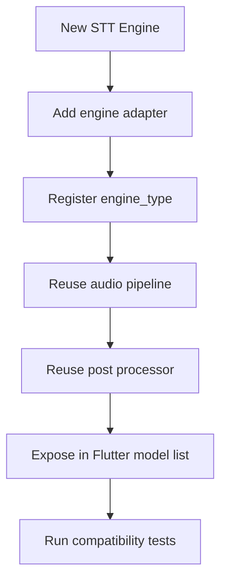

# Voices 项目规划与共识

## 0. 目标一句话

用最简单的方式，把语音稳定地转成文字：先打通最小可用链路，再扩展多模型，再做通用优化与模型特异优化。

---

## 1. 已确认共识

1. `Flutter` 负责 UI 与交互，`C++ Native Core` 负责模型调用与常驻内存推理。  
2. 使用 `engine_type` 分发机制（`whisper` / `vosk` / `sensevoice_onnx` / future engines）。  
3. 先打通 `Whisper tiny`（约 75~78MB）完整链路，再扩展第二第三模型。  
4. 优化顺序：  
   1) 单模型可用  
   2) 多模型接入  
   3) 通用调优  
   4) 模型特异微调  
5. 统一的是接口与数据，不强行统一模型文件格式。

---

## 2. 关键架构原则

## 2.1 统一什么

- 统一 API：`load / warmup / transcribe_stream / transcribe_file / unload / status`
- 统一音频输入：内部标准化为统一 PCM 格式
- 统一输出结构：文本、分段、置信度、时间戳
- 统一错误码与日志格式

## 2.2 不统一什么

- 不强制把所有模型格式转成单一格式
- 不强制所有引擎共用同一推理后端

说明：  
模型格式（如 `ggml` / `onnx` / `vosk model dir` / `gguf`）属于不同生态，强转通常不可行或风险高。  
最稳妥方式是“多 Adapter + 统一 Engine API”。

---

## 3. 目标架构图（Mermaid，兼容基础语法）



---

## 4. 引擎可扩展机制图



---

## 5. 实施步骤（必须按序）

## Phase 1: Whisper tiny 最小链路打通

目标：只接一个模型，端到端可用。

范围：

- 实时语音转写（麦克风）
- 语音文件转写（支持多采样率输入，内部重采样）
- 模型加载、预热、卸载
- 基础标点和断句后处理

交付：

- `engine_type = whisper`
- 稳定 C API
- Flutter 端可选模型并调用

验收：

- 连续 10 次短语音实时转写稳定
- 音频文件转写稳定输出
- 失败有明确错误码与日志

## Phase 2: Engine API 固化与复用层

目标：后续模型可复用，不再改 Flutter 主流程。

范围：

- 固化 Engine Manager 生命周期
- 固化统一输出结构
- 固化统一错误处理
- 固化下载与缓存策略

## Phase 3: 多模型接入

目标：接入第二和第三引擎。

建议顺序：

1. `vosk`
2. `sensevoice_onnx`

要求：

- 仅新增 Adapter，不改主链路
- Flutter 只通过统一 API 调用

## Phase 4: 通用调优

目标：提升全模型共通质量。

范围：

- 音频前处理：重采样、VAD、分段、增益
- 文本后处理：标点、断句、空格规范
- 性能框架：预热、缓存、并发策略、延迟监控

## Phase 5: 模型特异微调

目标：逐模型做参数与策略优化。

范围：

- Whisper 参数微调
- Vosk 参数微调
- SenseVoice 参数微调

---

## 6. 调优策略（共识版）

顺序固定为：

1. 单模型可用
2. 多模型接入
3. 通用调优
4. 模型特异微调

理由：

- 过早深调单模型，会拖慢架构稳定
- 先有通用调优层，后续模型复用收益最大

---

## 7. 体积与适配控制策略

1. 逐步接入引擎，避免首版引入全部依赖
2. 引擎编译开关（按平台、按版本启用）
3. 模型不随安装包硬打包，优先下载缓存
4. 统一日志与 profiling，避免盲目优化

---

## 8. 建议的 C API 最小集合

```c
int engine_load(const char* engine_type, const char* model_path);
int engine_warmup(const char* engine_type);
int engine_transcribe_stream(const char* engine_type, const void* pcm, int bytes, int sample_rate, char** out_json);
int engine_transcribe_file(const char* engine_type, const char* file_path, char** out_json);
int engine_unload(const char* engine_type);
int engine_status(const char* engine_type, char** out_json);
void engine_free_string(char* p);
```

说明：  
Flutter 只依赖这组稳定 API，不感知底层具体引擎细节。

---

## 9. 功能质量目标

必须支持：

- 实时语音转文字
- 语音文件转文字
- 多采样率输入兼容（内部统一处理）
- 标点准确率与断句准确率持续提升
- 转写精度与性能持续提升

---

## 10. 仓库约定

- `voices/dicta` 目录用于参考，不作为本项目提交内容
- 每阶段完成后必须记录：
  - 变更范围
  - 验证命令
  - 验证结果

---

## 11. 最终北极星

形成一个可长期演进的跨平台语音转写底座：  
`Flutter UI + C++ Native Core + 可扩展多模型引擎`，先快后稳，先通再优。

---

## 12. 当前落地状态（2026-02-21）

## Phase 1（Whisper tiny 最小链路）

- Android 已接入 `whisper.cpp`（`whisperlib` 模块）
- 默认引擎已切为 `whisper`
- 内置模型已切为 `assets/models/whisper-tiny/ggml-tiny.bin`（约 74MB）
- 已完成真机加载验证：`Whisper model loaded`

## Phase 2（Engine API 固化）

- 已统一 MethodChannel API：
  - `engineLoad`
  - `engineTranscribePcm`
  - `engineTranscribe`
  - `engineUnload`
  - `engineStatus`
- Flutter 主流程通过统一 API 调用，不再耦合单引擎入口

## Phase 3（多模型接入）

- 已接入：
  - `whisper`
  - `vosk`
- `sensevoice_onnx` 已接入统一服务层（`sherpa_onnx`），并可在设置中选择
- 当前仓库内 `sensevoice-onnx/model_quant.onnx` 不符合 `sherpa-onnx` 期望 metadata（缺少 `vocab_size` 等），已做“加载前拦截”，避免触发 native 崩溃
- 结论：需要替换为 `sherpa-onnx` 官方/兼容的 SenseVoice ONNX 模型后，才能真正进入可用状态

## 本轮关键修正（避免模型混杂）

- Whisper 模型发现逻辑已收紧：仅接受 `ggml*.bin`
- 移除会误命中通用 `whisper` 目录的别名路径
- 修复 Android 资产路径判断误判问题，避免错误复制不存在文件
- 增加 SenseVoice 模型兼容性预检：不满足 metadata 条件时直接报错，不进入 native 创建流程
- 增加引擎生命周期优化：同引擎同路径时不重复重载，减少无效加载
- 增加引擎切换失败回滚：切换失败会自动恢复到上一个可用引擎，避免“选中错误模型后主链路不可用”

## 本轮验证命令

- `flutter analyze`：通过
- `flutter test`：通过（42 个测试）
- `flutter build apk --debug`：通过
- `flutter run -d Pixel 8`：通过（日志确认 `Whisper model loaded`）

## 本轮更新（2026-02-22）

### 代码优化

- 修复 `platform_transcription_service.dart`：将遗留便捷方法标记为 `@Deprecated`，明确说明应使用新的引擎指定方法
- 修复 `audio_recorder_service.dart`：实时转写只处理最近 30 秒音频数据，避免因累积音频数据导致推理时间过长

### 单元测试

新增测试文件：
- `test/audio_input_test.dart`：AudioInput 模型测试
- `test/transcription_result_test.dart`：TranscriptionResult 和 TranscriptionSegment 测试
- `test/engine_definition_test.dart`：EngineDefinition 模型测试
- `test/engine_instance_test.dart`：EngineInstance 模型测试
- `test/transcription_service_test.dart`：TranscriptionService 测试
- `test/engine_registry_test.dart`：EngineRegistry 测试

验证：
- `flutter test`：42 个测试全部通过
- `flutter build ios --simulator --no-codesign`：通过
- `flutter build macos`：通过（206MB）
- `adb` 真机回归：通过
  - Whisper 启动可用
  - 选择不兼容 SenseVoice 模型时不再导致进程崩溃（改为可见错误）

## 本轮更新（2026-03-05）

### 音频格式支持

- 添加 `file_picker` 依赖，支持从文件选择器选择音频文件
- 在 `PlatformTranscriptionService` 添加 `engineTranscribeFile` 方法
- 在 `TranscriptionService` 添加 `transcribeFile` 方法
- 在 Android 端 `TranscriptionEngine` 添加音频文件解码逻辑：
  - 使用 `MediaExtractor` + `MediaCodec` 解码常见音频格式
  - 支持自动重采样到 16kHz
  - 无需额外依赖，保持 APK 体积
- 在 HomeScreen 添加文件选择按钮（上传图标）

### 验证

- `flutter analyze`：通过
- `flutter test`：42 个测试全部通过
- `flutter build apk --debug`：通过

---

## 13. 全平台多引擎集成计划（2026-03-05 启动）

### 目标

参考 Dicta 项目，让 voices-flutter 在 **Android、iOS、macOS** 三个平台上都能使用本地 STT 引擎。

### 核心架构决策

iOS/macOS 使用 `sherpa_onnx` Dart 插件作为主要推理后端（不写额外 native 代码），只有 Apple Speech 需要 Swift MethodChannel 代码。

### 平台×引擎矩阵

| 引擎 | Android | iOS | macOS |
|------|---------|-----|-------|
| Whisper | MethodChannel → JNI whisper.cpp (ggml) | sherpa_onnx Dart (ONNX) | sherpa_onnx Dart (ONNX) |
| Vosk | MethodChannel → vosk-android (Java) | sherpa_onnx Dart (Transducer ONNX) | sherpa_onnx Dart (Transducer ONNX) |
| SenseVoice | sherpa_onnx Dart (ONNX) | sherpa_onnx Dart (ONNX) | sherpa_onnx Dart (ONNX) |
| Apple Speech | 不可用 | MethodChannel → SFSpeechRecognizer | MethodChannel → SFSpeechRecognizer |

### 实施阶段

#### Phase A: 修复 SenseVoice ONNX（所有平台）
- **状态**: 已完成（代码与验证完成）
- 已完成：`sensevoice_onnx_service.dart` 模型文件名搜索与兼容性预检收敛
- 已完成：`model_download_manager.dart` 下载/解压链路与路径解析增强（含 Zip Slip 防护、大小/条目限制）
- 已完成：错误语义统一（`Error:` 前缀）与失败可见性
- 已完成：三平台构建验证（Android/iOS/macOS）
- **关键文件**: `lib/services/sensevoice_onnx_service.dart`, `lib/services/model_download_manager.dart`, `lib/services/transcription_service.dart`

#### Phase B: Sherpa-ONNX Whisper 服务（iOS/macOS）
- **状态**: 已完成（最小闭环）
- 已新增 `lib/services/sherpa_whisper_service.dart`（load/transcribePcm/unload/status/lastError）
- 已接入 `OfflineWhisperModelConfig`
- 已完成 `transcription_service.dart` 平台感知路由：
  - Android `whisper` 继续走 MethodChannel/native（保持不变）
  - iOS/macOS `whisper` 走 Sherpa ONNX
- 已完成 `transcribeFile()` 能力边界处理：iOS/macOS Whisper 文件直转返回 `Error:` 且不污染全局 ready 状态
- 已完成 `model_download_manager.dart` 的 Apple Whisper ONNX 目录识别（encoder/decoder/tokens）
- 已补充测试：`test/sherpa_whisper_service_test.dart`，并扩展 `test/transcription_service_test.dart`
- **关键文件**: `lib/services/sherpa_whisper_service.dart`, `lib/services/transcription_service.dart`, `lib/services/model_download_manager.dart`, `test/sherpa_whisper_service_test.dart`, `test/transcription_service_test.dart`

#### Phase C: Sherpa-ONNX Vosk 替代服务（iOS/macOS）
- **状态**: 已完成（最小闭环）
- 已新增 `lib/services/sherpa_vosk_service.dart`（load/transcribePcm/unload/status/lastError）
- 已接入 `OfflineParaformerModelConfig` + `OfflineTransducerModelConfig` 双路径识别（按模型文件自动匹配）
- 已完成 `transcription_service.dart` 平台感知路由：
  - Android `vosk` 保持 MethodChannel/native 路径
  - iOS/macOS `vosk` 走 Sherpa ONNX
- 已完成 `model_download_manager.dart` 在 Apple 平台对 Vosk ONNX 目录识别（model.onnx 或 encoder/decoder/joiner + tokens.txt）
- 已补充测试：`test/sherpa_vosk_service_test.dart`，并扩展 `test/transcription_service_test.dart`
- **关键文件**: `lib/services/sherpa_vosk_service.dart`, `lib/services/transcription_service.dart`, `lib/services/model_download_manager.dart`, `test/sherpa_vosk_service_test.dart`, `test/transcription_service_test.dart`

#### Phase D: Apple Speech 引擎（仅 iOS + macOS）
- **状态**: 已完成（文件转写链路）
- 已在 iOS `AppDelegate.swift` 添加 MethodChannel `com.sanbo.voices/apple_speech`
- 已在 macOS `MainFlutterWindow.swift` 添加同名 MethodChannel
- 已新建 `lib/services/apple_speech_service.dart`
- 已完成 Apple Speech 文件转写路由接入 `transcription_service.dart`（`apple_speech`）
- 已在 iOS/macOS Info.plist 增加 `NSSpeechRecognitionUsageDescription`
- 当前能力边界：Apple Speech 仅支持文件转写；实时 PCM 转写返回明确 `Error:` 且不污染全局 ready 状态
- **关键文件**: `ios/Runner/AppDelegate.swift`, `macos/Runner/MainFlutterWindow.swift`, `lib/services/apple_speech_service.dart`, `lib/services/transcription_service.dart`

#### Phase E: 模型下载系统
- **状态**: 已完成
- 已新建 `lib/models/model_registry.dart`（6 个可下载模型 + 3 个内置模型定义）
- 已实现 `model_download_manager.dart`：Dio 流式下载、多文件下载、SHA-256 校验、ZIP 解压（含 Zip Slip 防护）
- 已实现 Settings UI：下载按钮、进度条、删除、已下载模型管理、手动路径配置
- 已实现 Riverpod `ModelDownloadNotifier` 状态管理
- **关键文件**: `lib/models/model_registry.dart`, `lib/services/model_download_manager.dart`, `lib/screens/settings_screen.dart`, `lib/providers/providers.dart`

#### Phase F: 统一重构 + 清理
- **状态**: 已完成
- 已定义 `EngineBackend` 抽象接口（`lib/engines/base/engine_backend.dart`）
- 已实现各后端：`PlatformEngineBackend`, `SherpaWhisperBackend`, `SherpaVoskBackend`, `SenseVoiceBackend`, `AppleSpeechBackend`
- 已创建 `BackendResolver`（根据 engineId + platform 返回正确后端）
- 已将 `TranscriptionService` 从 if-else 路由重构为 BackendResolver 统一分发
- 已删除死代码：`engines/adapters/`（3 个适配器）、`transcription_engine.dart`、`engines.dart`（EngineInitializer）、`engine_registry.dart`
- 已更新 `main.dart` 移除 EngineInitializer 调用
- 已为 Sherpa 服务（Whisper/Vosk/SenseVoice）添加文件转写能力（纯 Dart WAV 解码 + 重采样）
- 已更新所有后端的 `transcribeFile()` 从硬编码 Error 改为委托到服务层
- **关键文件**: `lib/engines/base/engine_backend.dart`, `lib/engines/backend_resolver.dart`, `lib/engines/backends/*.dart`, `lib/services/transcription_service.dart`, `lib/services/sherpa_whisper_service.dart`, `lib/services/sherpa_vosk_service.dart`, `lib/services/sensevoice_onnx_service.dart`

### 验证标准

每个 Phase 完成后：
- `flutter analyze`：无错误
- `flutter test`：所有测试通过
- `flutter build apk --debug`：Android 构建通过
- `flutter build ios --simulator --no-codesign`：iOS 构建通过
- `flutter build macos`：macOS 构建通过

最终目标：
- Android：Whisper + Vosk + SenseVoice 三引擎均可用
- iOS：Whisper + Vosk + SenseVoice + Apple Speech 四引擎均可用
- macOS：Whisper + Vosk + SenseVoice + Apple Speech 四引擎均可用

## 本轮更新（2026-04-28）

### 架构重构：BackendResolver 接入 TranscriptionService

- 重构 `transcription_service.dart`：从 ~491 行 if-else 路由精简为 ~310 行 BackendResolver 统一分发
- 移除对 5 个独立服务的直接依赖（PlatformTranscriptionService、SenseVoiceOnnxService、SherpaWhisperService、SherpaVoskService、AppleSpeechService）
- 统一通过 `EngineBackend` 接口调用 `load/transcribePcm/transcribeFile/unload`

### 功能补全：Sherpa 服务文件转写

- 为 `SherpaWhisperService`、`SherpaVoskService`、`SenseVoiceOnnxService` 添加 `transcribeFile()` 方法
- 纯 Dart 实现 WAV 解码：RIFF header 解析、PCM 16-bit 提取、stereo→mono 转换、线性重采样到 16kHz
- 更新三个后端文件的 `transcribeFile()` 从硬编码 Error 改为委托到服务层

### 多引擎支持：PlatformEngineBackend

- `PlatformEngineBackend` 构造函数接受 `engineId` 参数（不再写死 `'whisper'`）
- `BackendResolver` 对 Android Whisper/Vosk 正确传递 engineId

### 死代码清理

- 删除 `lib/engines/adapters/`（whisper_engine、vosk_engine、sensevoice_engine）
- 删除 `lib/engines/base/transcription_engine.dart`（ITranscriptionEngine 接口）
- 删除 `lib/engines/engines.dart`（EngineInitializer）
- 删除 `lib/engines/registry/engine_registry.dart` + 对应测试
- 更新 `main.dart` 移除 EngineInitializer 调用

### 验证

- `flutter analyze`：无错误
- `flutter test`：84 个测试全部通过
- `flutter build apk --debug`：通过
- `flutter build ios --simulator --no-codesign`：通过
- `flutter build macos`：通过

## 本轮更新（2026-05-01）

### Bug Fix：模型切换失败

**问题**：切换模型（如从 Whisper 切换到 Apple Speech）后，新模型无法正常工作。

**根因**：`loadEngine()` 切换模型时只调用了 `unload()`，没有调用 `dispose()`。`AppleSpeechBackend` 的 `_partialResultController` 从未被关闭，导致再次加载时 `startPcmTranscription()` 失败。

**修复**：`transcription_service.dart` 的 `unloadEngine()` 同时调用 `unload()` 和 `dispose()`：

```dart
Future<void> unloadEngine() async {
  final backend = _currentBackend;
  _currentBackend = null;
  if (backend != null) {
    await backend.unload();  // 释放异步资源（音频引擎）
    backend.dispose();       // 释放同步资源（StreamController）
  }
  _state = TranscriptionServiceState.idle;
  _currentModelPath = null;
  _currentEngineId = null;
  _errorMessage = null;
}
```

**验证**：
- `flutter analyze`：无错误
- `flutter test`：84 个测试全部通过
- `flutter build apk --debug`：通过

## 本轮更新（2026-05-02）

### Phase 5 完成：引擎配置参数支持 + 默认线程数优化

**引擎配置类**：
- `WhisperConfig`：language, task, tailPaddings, numThreads, provider, debug
- `SenseVoiceConfig`：language, useInverseTextNormalization, numThreads, provider, debug
- `VoskConfig`：numThreads, provider, debug

**默认参数优化**：
- 所有引擎 `numThreads` 从 2 提升到 4，提升现代多核设备性能

**Git 修复**：
- 修复 `.gitignore`：`models/` → `/models/`（避免误匹配 `voices-flutter/lib/models/`）
- 添加 `lib/models/` 目录到 git（6 个文件：audio_input.dart, engine_config.dart, engine_definition.dart, engine_instance.dart, model_registry.dart, transcription_result.dart）

### Phase 4 验证完成

- 音频前处理：VAD、重采样、分段、增益（`lib/audio/`）
- 文本后处理：标点、断句、空格规范化（`lib/text/`）
- 性能框架：预热、延迟追踪、并发配置（`lib/performance/`）

### 验证

- `flutter analyze`：无错误
- `flutter test`：84 个测试全部通过
- `flutter build apk --debug`：通过
- `flutter build ios --simulator --no-codesign`：通过

## 本轮更新（2026-05-02）

### 全平台兼容升级：Linux/Windows 支持

**目标**：修复硬编码的 Android/iOS/macOS 平台假设，使 Linux/Windows 桌面端可编译运行。

**平台×引擎矩阵（扩展后）**：

| 引擎 | Android | iOS | macOS | Linux | Windows |
|------|---------|-----|-------|-------|---------|
| Whisper | MethodChannel (ggml) | sherpa_onnx (ONNX) | sherpa_onnx (ONNX) | sherpa_onnx (ONNX) | sherpa_onnx (ONNX) |
| Vosk | MethodChannel (Kaldi) | sherpa_onnx (ONNX) | sherpa_onnx (ONNX) | sherpa_onnx (ONNX) | sherpa_onnx (ONNX) |
| SenseVoice | sherpa_onnx (ONNX) | sherpa_onnx (ONNX) | sherpa_onnx (ONNX) | sherpa_onnx (ONNX) | sherpa_onnx (ONNX) |
| Apple Speech | N/A | SFSpeechRecognizer | SFSpeechRecognizer | N/A | N/A |

**变更范围**：

1. `lib/models/model_registry.dart`：`DownloadableModelDefinition` 和 `BuiltinModelDefinition` 添加 `linux`/`windows` 字段；ONNX 模型启用 linux/windows 支持
2. `lib/services/sensevoice_onnx_service.dart`：将 Android-only 路径（`/storage/emulated/0/...`）和 `getExternalStorageDirectory()` 包裹在 `Platform.isAndroid` 检查中
3. `lib/screens/settings_screen.dart`：`_recommendedModelDir()` 添加 Linux/Windows 分支；`_modelUsageHint()` 将 `Platform.isIOS || Platform.isMacOS` 改为 `!Platform.isAndroid`
4. `lib/utils/model_format_adapter.dart`：Whisper GGML 和 Vosk Kaldi 适配条件从 `Platform.isIOS || Platform.isMacOS` 改为 `!Platform.isAndroid`
5. `lib/utils/model_format_detector.dart`：错误消息从 "iOS/macOS" 改为 "其他平台"
6. `lib/models/engine_config.dart`：三个配置类的 `fromMap()` numThreads 默认值从 2 修正为 4（与构造函数一致）
7. `lib/screens/home_screen.dart`：文案平台感知，桌面端去掉 "手机" 字样

**验证**：
- `flutter analyze`：无错误
- `flutter test`：84 个测试全部通过
- `flutter build macos`：通过（129.9MB）
- `flutter build linux`：需 Linux 主机验证（macOS 上无法构建）
- `flutter build windows`：需 Windows 主机验证

---

## 14. 本地 AI 能力扩展计划（2026-05-04）

### 目标

将 voices-flutter 从单一语音转文字应用，扩展为**移动端本地 AI 综合能力平台**，支持：

| 能力 | 状态 | 说明 |
|------|------|------|
| 语音转文字（ASR） | 已有 | Whisper/Vosk/SenseVoice |
| 实时语音转文字 | 已有 | Whisper/Vosk/SenseVoice |
| 文字转语音（TTS） | 已有 | sherpa-onnx VITS/Kokoro |
| 本地 LLM 对话 | 已有 | llama_cpp_dart (GGUF) |
| 文字翻译 | 已有 | LLM (本地 GGUF) |
| 图像理解（多模态） | 已有 | llama.cpp LLaVA (GGUF) |

### 核心决策

1. **模型格式**：ONNX + GGUF 双格式支持
2. **模块化设计**：封装为 SDK 风格，便于未来迁移复用
3. **体积控制**：尽量 1GB 以内，通过提示词工程和反思机制保证小模型稳定性
4. **下载策略**：按需下载，设置页面管理

### 技术方案

#### TTS（文字转语音）

| 模型 | 大小 | 格式 | 中文 | 推荐 |
|------|------|------|------|------|
| Kokoro-82M-zh | ~100MB (Q4) | Original/MLX | ✅ | ⭐⭐⭐⭐⭐ |
| vits-melo-tts-zh_en | ~150MB | ONNX | ✅ | ⭐⭐⭐⭐ |
| MOSS-TTS-Nano-100M | ~400MB | ONNX | ✅ | ⭐⭐⭐ |

**推荐方案**：sherpa-onnx（与现有技术栈一致）+ Kokoro（TTS 质量好）

#### 本地 LLM（GGUF 量化）

| 模型 | 原始大小 | Q4_K_M 大小 | 特点 |
|------|----------|-------------|------|
| SmolLM-0.4B | ~800MB | ~200MB | 最小，最快 |
| Qwen2-0.5B | ~1GB | ~300MB | 中英双语好 |
| Gemma-2B | ~2GB | ~1.2GB | Google 质量好 |
| Phi-3-mini | ~4GB | ~2GB | Microsoft 质量高 |
| Llama-3.2-1B | ~2GB | ~600MB | Meta 均衡 |

**推荐方案**：llama_cpp_dart（Flutter GGUF 绑定）

#### 语音翻译

使用 Whisper 模型直接进行语音翻译，支持：
- 中英翻译
- 中日翻译
- 中韩翻译

#### 多模态（图像理解）

| 模型 | 大小 | 说明 |
|------|------|------|
| LLaVA-Phi-3-mini | ~4B (Q4: 2-3GB) | 最小多模态，支持图像问答 |
| EraX-VL-2B | ~2B (Q4: ~1GB) | 轻量多模态 |

**确认**：接受 2-3GB 多模态模型

### 架构设计

```
lib/
├── engines/
│   ├── base/
│   │   ├── asr_backend.dart      # 语音识别基类（现有）
│   │   ├── tts_backend.dart      # 语音合成基类（新增）
│   │   ├── llm_backend.dart      # LLM 对话基类（新增）
│   │   └── vision_backend.dart    # 多模态基类（新增）
│   │
│   ├── asr/                      # 语音识别模块（现有）
│   │   └── sherpa_asr_backend.dart
│   │
│   ├── tts/                      # 语音合成模块（新增）
│   │   ├── sherpa_tts_backend.dart   # sherpa-onnx VITS
│   │   └── kokoro_tts_backend.dart   # Kokoro
│   │
│   ├── llm/                      # LLM 对话模块（新增）
│   │   ├── gguf_llm_backend.dart     # GGUF 格式 (llama.cpp)
│   │   └── onnx_llm_backend.dart     # ONNX 格式（备选）
│   │
│   ├── vision/                   # 多模态模块（可选）
│   │   └── llava_backend.dart
│   │
│   └── translation/              # 翻译模块（新增）
│       └── whisper_translation_backend.dart
│
├── services/
│   ├── asr_service.dart          # 语音识别服务（现有）
│   ├── tts_service.dart          # 语音合成服务（新增）
│   ├── llm_service.dart         # LLM 对话服务（新增）
│   ├── vision_service.dart       # 多模态服务（新增）
│   └── translation_service.dart  # 翻译服务（新增）
│
├── models/
│   └── tts_result.dart           # TTS 结果模型（新增）
│   └── llm_result.dart          # LLM 结果模型（新增）
│   └── vision_result.dart       # 多模态结果模型（新增）
│
└── screens/
    ├── home_screen.dart          # ASR 主界面（现有）
    ├── tts_screen.dart          # TTS 界面（新增）
    ├── llm_chat_screen.dart     # LLM 对话界面（新增）
    └── vision_screen.dart       # 多模态界面（新增）
```

### 实施阶段

#### Phase G: TTS 文字转语音
- **状态**: 已完成
- 新增 `TtsBackend` 接口（`lib/engines/base/tts_backend.dart`）
- 实现 `SherpaTtsBackend`（`lib/engines/backends/sherpa_tts_backend.dart`）
  - 支持 VITS / Kokoro / Matcha 模型自动检测
  - 使用 sherpa_onnx OfflineTts 进行推理
- 新增 `TtsService`（`lib/services/tts_service.dart`）
  - 使用 just_audio 播放音频
  - 内置 Float32→PCM 16-bit LE 转换和 WAV 文件生成
  - 支持 speak()（生成+播放）和 generate()（仅生成）
- 新增 `TtsScreen` UI（`lib/screens/tts_screen.dart`）
  - 底部导航集成（`MainShell`）
  - 支持声音选择、语速调节、生成按钮
- 新增 `TtsConfig` 配置类（`lib/models/engine_config.dart`）
- 添加 just_audio 依赖（`pubspec.yaml`）
- **关键文件**: `lib/engines/base/tts_backend.dart`, `lib/engines/backends/sherpa_tts_backend.dart`, `lib/services/tts_service.dart`, `lib/screens/tts_screen.dart`, `lib/screens/main_shell.dart`, `lib/models/engine_config.dart`

#### Phase H: 本地 LLM 对话
- **状态**: 已完成（最小闭环）
- 新增 `LlmBackend` 接口（`lib/engines/base/llm_backend.dart`）
  - 定义 `LlmBackendState`、`LlmMessage`、`LlmStreamResult` 等模型
  - 支持流式推理 `streamInfer()` 和同步推理 `infer()`
- 实现 `GgufLlmBackend`（`lib/engines/backends/gguf_llm_backend.dart`）
  - 使用 llama_cpp_dart `LlamaParent` 进行 GGUF 模型推理
  - 支持流式输出和对话历史管理
- 新增 `LlmService`（`lib/services/llm_service.dart`）
  - 管理 LLM 会话和状态
  - 支持流式推理和同步推理
- 新增 `LlmChatScreen` UI（`lib/screens/llm_chat_screen.dart`）
  - 底部导航集成（`MainShell`）
  - 支持流式输出显示、温度调节、清空对话
- 添加 llama_cpp_dart 依赖（`pubspec.yaml`）
- 升级 archive 依赖（`^3.4.0` → `^4.0.9`）以解决依赖冲突
- **关键文件**: `lib/engines/base/llm_backend.dart`, `lib/engines/backends/gguf_llm_backend.dart`, `lib/services/llm_service.dart`, `lib/screens/llm_chat_screen.dart`, `lib/screens/main_shell.dart`, `pubspec.yaml`

#### Phase I: 文字翻译
- **状态**: 已完成
- 新增 `TranslationService`（`lib/services/translation_service.dart`）
  - 使用 Whisper 的 `translate` 任务（未来用于语音翻译）
  - 支持 PCM 音频和 WAV 文件翻译
  - 支持中文→英文、英文→中文、自动检测三种方向
- 新增 `TranslationScreen` UI（`lib/screens/translation_screen.dart`）
  - 底部导航第四个 Tab
  - 支持翻译方向切换、文本交换
  - 使用 `LlmService.translateText()` 进行文字翻译
  - 导航标签更新为"文字翻译"
- **关键文件**: `lib/services/translation_service.dart`, `lib/services/llm_service.dart`, `lib/screens/translation_screen.dart`, `lib/screens/main_shell.dart`

#### Phase J: 多模态图像理解（可选）
- **状态**: 已完成（基础架构）
- 新增 `VisionBackend` 接口（`lib/engines/base/vision_backend.dart`）
  - 定义 `VisionBackendState`、`VisionResult` 等模型
  - 定义 `understand()` 图像理解方法
- 实现 `LlavaBackend`（`lib/engines/backends/llava_backend.dart`）
  - 使用 llama_cpp_dart `LlamaParent.sendPromptWithImages()` 进行图像理解
  - 支持 LLaVA 等 GGUF 格式多模态模型
- 新增 `VisionService`（`lib/services/vision_service.dart`）
  - 图像选择和理解流程管理
  - 支持文件选择器选择图像
- 新增 `VisionScreen` UI（`lib/screens/vision_screen.dart`）
  - 底部导航第五个 Tab
  - 支持图像选择、问题输入、结果展示
- **关键文件**: `lib/engines/base/vision_backend.dart`, `lib/engines/backends/llava_backend.dart`, `lib/services/vision_service.dart`, `lib/screens/vision_screen.dart`, `lib/screens/main_shell.dart`
- **注意**: 需要 GGUF 格式的 LLaVA/Moondream 等多模态模型，移动端内存需求较高（~2-3GB）

### 提示词工程策略（保证小模型稳定性）

1. **结构化提示词模板**：为每个能力设计专用 prompt
2. **反思机制**：小模型输出后，引导自我检查
3. **Chain of Thought**：复杂任务分步推理
4. **输出格式约束**：JSON/结构化输出保证一致性
5. **不限制输出长度**：避免人为限制模型能力

### 对话交互设计

**LLM 语音对话**：全程语音交互，类似 Siri 但完全本地
```
语音输入 → ASR → LLM 推理 → TTS 语音输出
```
- 默认语音进 → 语音出
- 可切换文字模式

**TTS 多声音支持**：
- 支持多声音可选（女声/男声/不同风格）
- sherpa-onnx VITS 多说话人版本
- Kokoro 103 说话人

**LLM 多模型支持**：
- 默认：Qwen2-0.5B Q4（最小体积 ~300MB）
- 支持全部 GGUF 量化模型：Gemma-2B、Phi-3-mini、Llama-3.2-1B 等
- 模型下载后自动识别，无需硬编码

**多模态能力**：
- 看图说话：描述图片内容
- 图文问答：回答关于图片的问题

### 技术设计决策

**TTS 策略**：
- 等完整句子/段落后再 TTS 播报（连贯性优先）
- TTS 流式合成，边生成边缓存
- 最终 wav 完整保存用于回放

**对话打断机制**：
- 全程可随时说"停止"打断 AI 说话
- VAD 检测静音自动结束录音
- AI 说话时识别到"停止"/"取消"立即中断 TTS

**LLM 模型发现机制**：
- 混合模式：自动识别 + 手动覆盖
- 读取 GGUF hparam 元数据自动识别架构
- 自动适配 chat template（Llama/Qwen/Gemma/Phi）
- 用户可手动指定 model type 覆盖自动识别

**多模态模型选择**：
- 优先复用已下载的 LLM 模型（如 Qwen/Gemma）
- 同时支持独立多模态模型（LLaVA-Phi-3-mini）
- CLIP 作为视觉编码器

**流式响应架构**：
```
用户说完话 → ASR 识别完成 → LLM 流式推理 → TTS 句子完整后播报
                ↓
          可边识别边开始 LLM 推理（减少延迟）

总延迟预算：~2-3 秒（可接受）
```

**内存管理策略**：
- ASR + TTS + LLM 总预算 ~2GB
- LLM 默认使用最小模型（Qwen2-0.5B）
- 不用 TTS 时可卸载 TTS 模型释放内存
- 实时显示当前内存使用状态

### 验证标准

每个 Phase 完成后：
- `flutter analyze`：无错误
- `flutter test`：所有测试通过
- `flutter build apk --debug`：Android 构建通过
- `flutter build ios --simulator --no-codesign`：iOS 构建通过
- `flutter build macos`：macOS 构建通过
- 真机功能验证：各能力端到端可用
